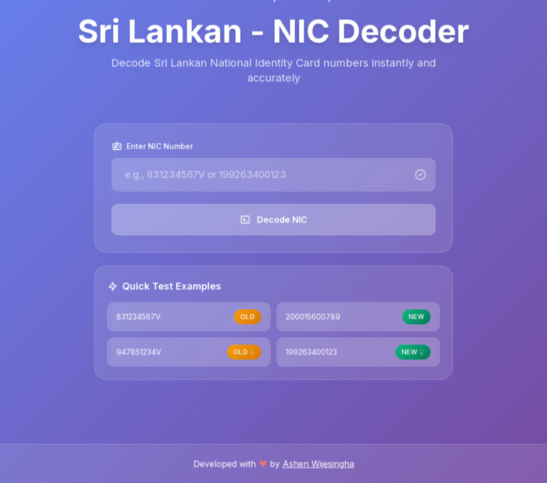

# 🇱🇰 Sri Lankan NIC Decoder

A beautifully designed web application that decodes Sri Lankan National Identity Card (NIC) numbers. Enter either an **old 10-digit** or **new 12-digit** NIC and instantly retrieve the holder’s **date of birth**, **gender**, **day of the week**, **NIC format**, and **voter eligibility**.

 <!-- Replace with your preview image URL -->

---

## 🚀 Features

- 🆔 Supports **both old (XXXXXXXXXV)** and **new (YYYYXXXXXXX)** NIC formats
- 🎂 Calculates **Date of Birth** accurately (fixes common +1 or +2 day issues)
- 👩‍🦰 Detects **Gender** from NIC structure
- 🗳️ Identifies **Voter Eligibility** (for old NICs)
- 📅 Displays **Day of the Week** for birthdate
- 📱 Fully **responsive UI** built with Tailwind CSS
- ✨ Smooth animations & interactive example buttons

---

## 🖼️ Live Demo

👉 [https://ashenwijesingha.github.io/SL-NIC-Decoder/](https://ashenwijesingha.github.io/SL-NIC-Decoder/)

---

## 🔧 Installation

You can clone and run this locally in your browser:

```bash
git clone https://github.com/your-username/nic-decoder.git
cd nic-decoder
open index.html
